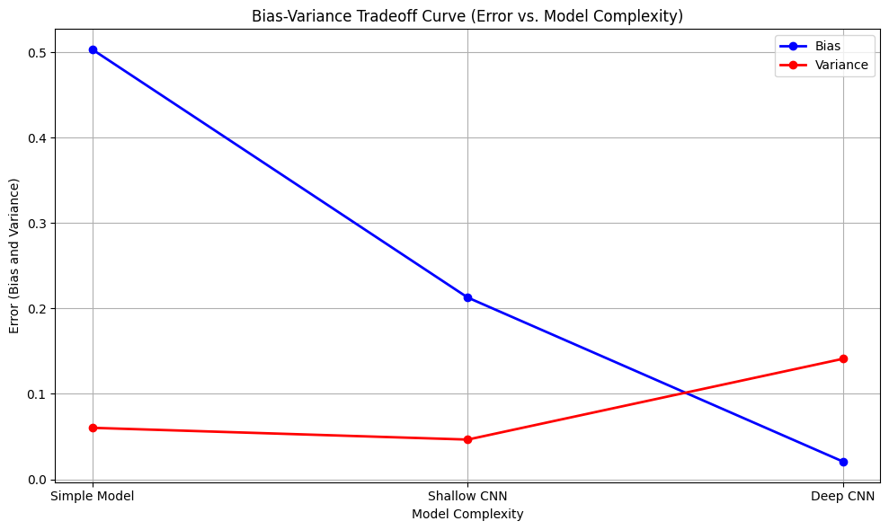
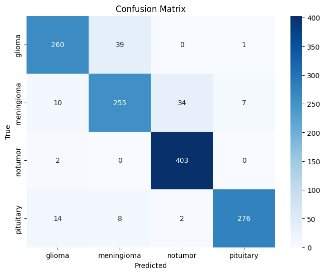

# Impact of Bias-Variance Tradeoff on Model Performance for Medical Image Analysis

## Project Overview
This project focuses on **brain tumor classification using MRI images** and investigates the impact of the **bias-variance tradeoff** on model performance. Brain tumors are categorized into four classes: **glioma, meningioma, pituitary tumor, and no tumor**. Accurate classification is critical in healthcare applications, as it aids in early diagnosis and treatment planning.

We evaluate multiple models of increasing complexity:
- **Simple Dense Model**: High bias, low variance (underfitting).  
- **Shallow CNN**: Moderate complexity, balances bias and variance.  
- **Deep CNN (ResNet50)**: Low bias, high variance (overfitting).  
- **Intermediate CNN**: Balanced architecture with dropout for regularization, achieving optimal accuracy and generalization.  

---

## Bias-Variance Tradeoff Evaluation
Understanding the bias-variance tradeoff is crucial for building models that generalize well. In this project, we systematically analyze how model complexity affects **training and test error**:

- **High-bias models** (simple dense) underfit the data, failing to capture complex features.  
- **High-variance models** (deep CNNs like ResNet50) overfit the training data, reducing generalization.  
- **Balanced models** (intermediate CNN) achieve an optimal tradeoff, minimizing both bias and variance.

The figure below illustrates the **Error vs Model Complexity** curve across the evaluated models:

As shown, the intermediate model achieves the best tradeoff, combining sufficient complexity to capture relevant patterns while avoiding overfitting.

---

## Confusion Matrix of the Intermediate Model
The final **intermediate CNN** demonstrated the best performance with high accuracy across all classes. The confusion matrix below highlights the model's ability to correctly classify each tumor type:

The high values along the diagonal indicate strong performance in all categories, confirming that the model generalizes well to unseen data.

---

## Dataset
The project uses an openly available dataset of **7,023 brain MRI images**, divided into:
- Training set: 4,569 images  
- Validation set: 1,143 images  
- Test set: 1,311 images  

Data augmentation (rotations, shifts, zooms, flips) was applied to improve generalization and reduce overfitting.

---

## Methodology
1. Preprocess images by normalizing pixel values.  
2. Train models of varying complexity: simple dense, shallow CNN, deep CNN (ResNet50), and intermediate CNN.  
3. Evaluate training and test performance to analyze bias and variance.  
4. Select the intermediate CNN as the optimal model for high accuracy and generalization.  

---

## Results
- **Simple Dense Model**: Test accuracy ~53.7% (high bias, underfitting)  
- **Shallow CNN**: Test accuracy ~77.8% (moderate bias-variance)  
- **Deep CNN (ResNet50)**: Test accuracy ~88.0% (high variance, overfitting)  
- **Intermediate CNN**: Test accuracy ~91.4% (optimal bias-variance balance)

The results highlight the importance of balancing **bias and variance** when designing machine learning models for medical diagnostics.

---

## Conclusion
The intermediate CNN provides the **best tradeoff between underfitting and overfitting**, achieving high accuracy while maintaining generalization. This study demonstrates the importance of bias-variance analysis in building **robust, reliable, and clinically meaningful machine learning models** for healthcare applications.

---

## Files in Repository
- `main.ipynb` — Jupyter notebook with model implementation and training.  
- `Report.pdf` — Project report.  
- `tradeoff.png` — Error vs model complexity curve.  
- `confusion.png` — Confusion matrix of intermediate model.  

---

## License
This project is licensed under the MIT License.
